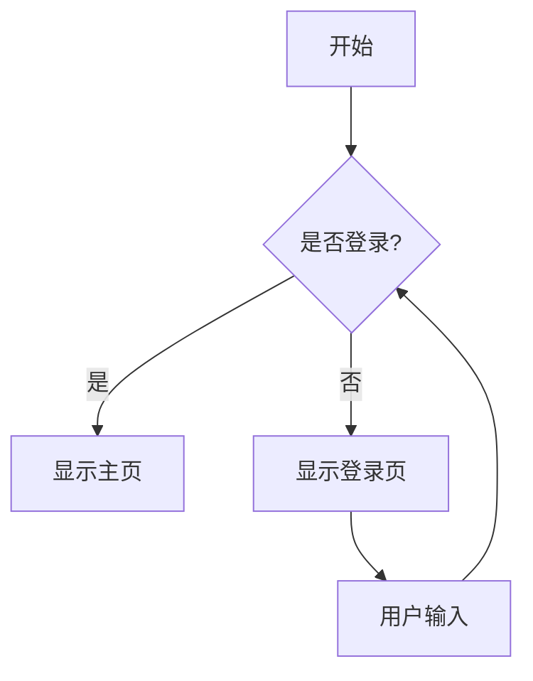
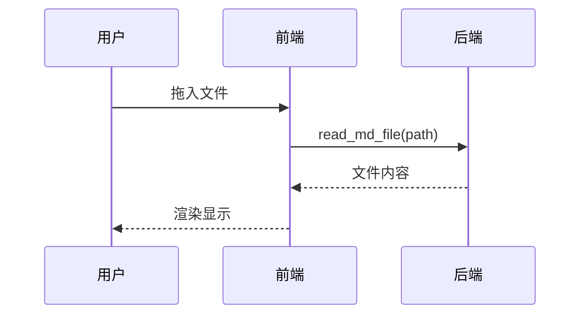
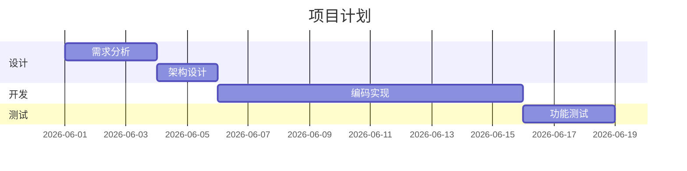
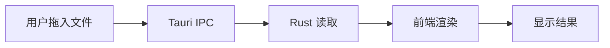
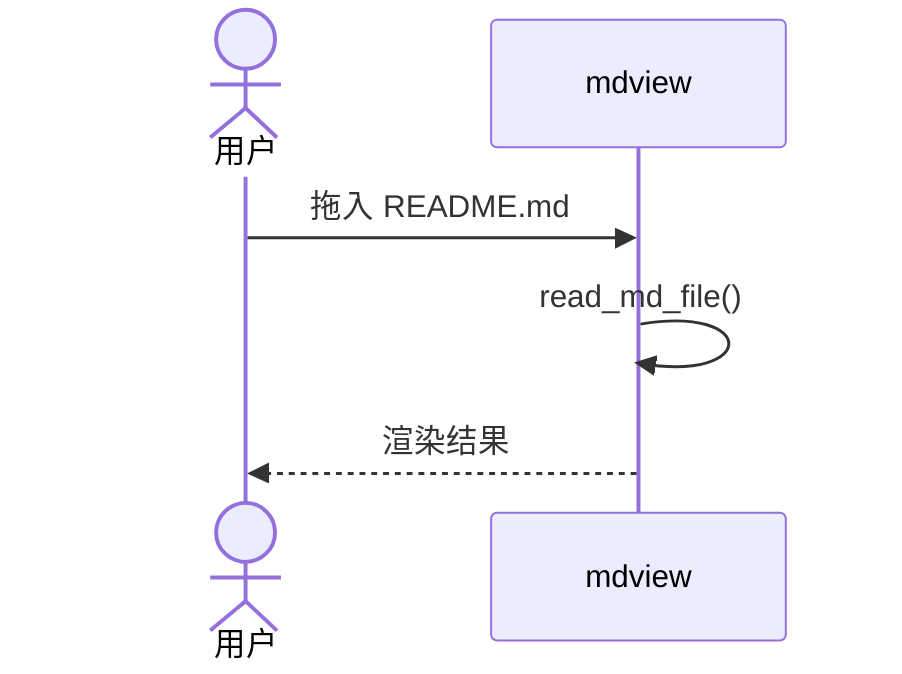

# mdview Implementation Plan

> **For agentic workers:** REQUIRED SUB-SKILL: Use superpowers:subagent-driven-development (recommended) or superpowers:executing-plans to implement this plan task-by-task. Steps use checkbox (`- [ ]`) syntax for tracking.

**Goal:** 构建一个跨平台(macOS + Windows)Markdown 预览桌面应用,用户拖入 .md 文件即可看到包含代码高亮、数学公式、流程图的完整渲染效果。

**Architecture:** Tauri 2.x 应用。Rust 后端仅一个命令 `read_md_file(path)` 用于读取文件;前端(HTML+CSS+JS)负责拖放事件、调用 Rust、以及 marked+highlight.js+KaTeX+Mermaid 的渲染流水线。WebView 系统自带(Windows 用 WebView2,macOS 用 WebKit),用户零依赖。

**Tech Stack:** Rust 2021 + Tauri 2.x + 原生 HTML/CSS/JS + marked.js + highlight.js + KaTeX + Mermaid

**Spec:** `docs/superpowers/specs/2026-06-04-mdview-design.md`

---

## File Structure

创建以下文件(此项目从零开始,无现有代码):

| 路径 | 职责 |
|---|---|
| `src-tauri/Cargo.toml` | Rust 依赖声明 |
| `src-tauri/tauri.conf.json` | Tauri 窗口、bundle、安全策略配置 |
| `src-tauri/build.rs` | Tauri 构建脚本 |
| `src-tauri/src/main.rs` | 应用入口 + read_md_file 命令 |
| `src/index.html` | 前端主页面 |
| `src/styles.css` | GitHub 风格主题 |
| `src/main.js` | 拖放、IPC、渲染流水线 |
| `src/vendor/marked.min.js` | Markdown 解析(本地打包) |
| `src/vendor/highlight.min.js` | 代码高亮(本地打包) |
| `src/vendor/katex.min.js` | 数学公式(本地打包) |
| `src/vendor/katex.min.css` | KaTeX 样式(本地打包) |
| `src/vendor/mermaid.min.js` | 流程图(本地打包) |
| `assets/icon.ico` | Windows 图标 |
| `assets/icon.icns` | macOS 图标 |
| `assets/icon.png` | 通用 PNG 图标 |
| `test-samples/*.md` | 5 个测试样本文件 |
| `.gitignore` | 忽略 target/、node_modules/ 等 |
| `README.md` | 项目说明 |

**职责单一原则**:
- `main.rs` 只做一件事:注册一个 read 命令 + 启动窗口
- `main.js` 只做一件事:把拖放事件串到渲染流水线
- `styles.css` 只做一件事:GitHub 风格主题样式
- 每个 vendor 库是独立文件,互不污染

---

## 任务概览

| # | 任务 | 预计时间 |
|---|---|---|
| 1 | 环境准备(开发机装 Rust + Node + Tauri CLI) | 15 分钟 |
| 2 | 项目脚手架(Cargo.toml、tauri.conf.json、目录结构) | 10 分钟 |
| 3 | 最小可运行窗口(空 HTML + main.rs) | 15 分钟 |
| 4 | Rust 后端 read_md_file 命令 | 10 分钟 |
| 5 | 下载 vendor JS 库 | 10 分钟 |
| 6 | 拖放 + 基础 Markdown 渲染 | 20 分钟 |
| 7 | 代码高亮(highlight.js) | 15 分钟 |
| 8 | KaTeX 数学公式 | 15 分钟 |
| 9 | Mermaid 流程图 | 20 分钟 |
| 10 | 错误处理与提示横幅 | 15 分钟 |
| 11 | GitHub 风格样式 | 30 分钟 |
| 12 | 创建 5 个测试样本 md | 15 分钟 |
| 13 | 准备图标 | 10 分钟 |
| 14 | 编译发布版 + 跨平台验证 | 20 分钟 |

**总计:约 4 小时**

---

## Task 1: 环境准备(开发机)

**目标:** 在开发机上安装好 Rust、Node、Tauri CLI,验证 `cargo tauri --version` 能跑。

**Files:**
- (无文件操作,纯环境配置)

- [ ] **Step 1.1: 安装 Rust 工具链**

Windows(PowerShell):
```powershell
# 下载并运行 rustup-init
Invoke-WebRequest -Uri "https://win.rustup.rs/x86_64" -OutFile "rustup-init.exe"
.\rustup-init.exe -y
# 重启 shell 使 PATH 生效
```

macOS/Linux:
```bash
curl --proto '=https' --tlsv1.2 -sSf https://sh.rustup.rs | sh -s -- -y
source "$HOME/.cargo/env"
```

- [ ] **Step 1.2: 验证 Rust 安装**

```bash
rustc --version
cargo --version
```

**Expected output(任一):**
```
rustc 1.XX.X (...)
cargo 1.XX.X (...)
```

- [ ] **Step 1.3: 安装 Node.js LTS**

下载并安装:https://nodejs.org/(选 LTS 版本)

验证:
```bash
node --version
npm --version
```

**Expected:** Node 18+ 和 npm 9+

- [ ] **Step 1.4: 安装 Tauri CLI**

```bash
cargo install tauri-cli --version "^2.0"
```

**Expected:** 安装完成(可能需要 3-5 分钟)

- [ ] **Step 1.5: 验证 Tauri CLI**

```bash
cargo tauri --version
```

**Expected:**
```
tauri-cli 2.X.X
```

- [ ] **Step 1.6: 平台额外依赖**

Windows:
- 安装 [Microsoft Visual C++ Build Tools](https://visualstudio.microsoft.com/visual-cpp-build-tools/)(勾选「C++ build tools」工作负载)
- 安装 [WebView2](https://developer.microsoft.com/microsoft-edge/webview2/)(Win11 已自带,Win10 通常也有)

macOS:
```bash
xcode-select --install
```

- [ ] **Step 1.7: Commit(可选,环境配置不进 git)**

跳过 — 环境配置不进版本控制。

---

## Task 2: 项目脚手架

**目标:** 创建 Tauri 项目所需的目录结构和配置文件。

**Files:**
- Create: `.gitignore`
- Create: `README.md`
- Create: `src-tauri/Cargo.toml`
- Create: `src-tauri/tauri.conf.json`
- Create: `src-tauri/build.rs`
- Create: `src-tauri/src/main.rs`(空)
- Create: `src/index.html`(空)
- Create: `src/styles.css`(空)
- Create: `src/main.js`(空)
- Create: `assets/.gitkeep`

- [ ] **Step 2.1: 创建目录结构**

```bash
cd D:\opencode_work\markdownView
mkdir src-tauri\src
mkdir src\vendor
mkdir assets
mkdir test-samples
```

- [ ] **Step 2.2: 创建 `.gitignore`**

```gitignore
# Rust
target/
**/*.rs.bk
Cargo.lock

# Node(如果以后用)
node_modules/
package-lock.json

# IDE
.vscode/
.idea/
*.swp
.DS_Store

# OS
Thumbs.db

# Tauri
src-tauri/target/
src-tauri/gen/
```

- [ ] **Step 2.3: 创建 `src-tauri/Cargo.toml`**

```toml
[package]
name = "mdview"
version = "0.1.0"
description = "Markdown 预览桌面工具"
edition = "2021"
rust-version = "1.70"

[build-dependencies]
tauri-build = { version = "2.0", features = [] }

[dependencies]
tauri = { version = "2.0", features = [] }
serde = { version = "1", features = ["derive"] }
serde_json = "1"

[profile.release]
panic = "abort"
codegen-units = 1
lto = true
opt-level = "s"
strip = true
```

**注意**: `opt-level = "s"` + `lto = true` + `strip = true` 是体积优化的关键配置,能把编译产物压缩到 1-2MB。

- [ ] **Step 2.4: 创建 `src-tauri/tauri.conf.json`**

```json
{
  "$schema": "https://schema.tauri.app/config/2.0.0",
  "productName": "mdview",
  "version": "0.1.0",
  "identifier": "com.local.mdview",
  "build": {
    "frontendDist": "../src",
    "devUrl": "http://localhost:1420",
    "beforeDevCommand": "",
    "beforeBuildCommand": ""
  },
  "app": {
    "windows": [
      {
        "title": "Markdown 预览",
        "width": 1100,
        "height": 800,
        "minWidth": 600,
        "minHeight": 400,
        "resizable": true,
        "fullscreen": false,
        "fileDropEnabled": true
      }
    ],
    "security": {
      "csp": "default-src 'self'; style-src 'self' 'unsafe-inline'; script-src 'self'; img-src 'self' data:; font-src 'self' data:"
    }
  },
  "bundle": {
    "active": true,
    "targets": ["nsis", "dmg", "app"],
    "icon": [
      "assets/icon.ico",
      "assets/icon.icns",
      "assets/icon.png"
    ],
    "category": "Productivity",
    "shortDescription": "Markdown 预览",
    "longDescription": "拖入 .md 文件即可预览,支持代码高亮、数学公式、流程图"
  }
}
```

**关键配置说明**:
- `fileDropEnabled: true` — 启用文件拖放
- CSP 限制资源来自本地,符合离线需求
- `unsafe-inline` 是 KaTeX/Mermaid 需要的内联样式
- `targets: ["nsis", "dmg", "app"]` — 三个平台打包方式

- [ ] **Step 2.5: 创建 `src-tauri/build.rs`**

```rust
fn main() {
    tauri_build::build()
}
```

- [ ] **Step 2.6: 创建空的 `src-tauri/src/main.rs`**

```rust
fn main() {
    tauri::Builder::default()
        .run(tauri::generate_context!())
        .expect("启动失败");
}
```

**这是最小可运行版本,Task 4 会加 read_md_file 命令。**

- [ ] **Step 2.7: 创建空的 `src/index.html`**

```html
<!DOCTYPE html>
<html lang="zh-CN">
<head>
  <meta charset="UTF-8" />
  <title>Markdown 预览</title>
  <link rel="stylesheet" href="styles.css" />
  <link rel="stylesheet" href="vendor/katex.min.css" />
</head>
<body>
  <div id="placeholder">
    <h1>Markdown 预览</h1>
    <p>把 .md 文件拖入此窗口</p>
  </div>
  <div id="content" class="markdown-body"></div>
  <div id="error" class="error-banner" style="display:none"></div>

  <script src="vendor/marked.min.js"></script>
  <script src="vendor/highlight.min.js"></script>
  <script src="vendor/katex.min.js"></script>
  <script src="vendor/mermaid.min.js"></script>
  <script src="main.js"></script>
</body>
</html>
```

**注意**: 现在先引用 vendor 库,虽然文件还不存在 — 后续 Task 5 会创建。如果编译时找不到,会看到 404,这是预期的,Task 5 后修复。

- [ ] **Step 2.8: 创建空的 `src/styles.css`**

```css
body {
  margin: 0;
  padding: 0;
  font-family: -apple-system, BlinkMacSystemFont, "Segoe UI", "Microsoft YaHei", sans-serif;
}
```

- [ ] **Step 2.9: 创建空的 `src/main.js`**

```javascript
console.log('mdview loaded');
```

- [ ] **Step 2.10: 创建 `assets/.gitkeep`**

```bash
touch assets/.gitkeep
```

(占位文件,让目录进入版本控制。Task 13 会替换为真实图标)

- [ ] **Step 2.11: 创建 `README.md`**

```markdown
# mdview

简单的 Markdown 预览桌面工具。拖入 .md 文件即可查看渲染效果。

## 功能

- 标准 Markdown + GFM(表格、任务列表)
- 代码高亮
- 数学公式(KaTeX)
- 流程图(Mermaid)
- GitHub 风格主题

## 开发

```bash
cargo tauri dev      # 开发模式(热重载)
cargo tauri build    # 编译发布版
```

## 平台

- Windows 10/11(无需任何运行时)
- macOS 12+(无需任何运行时)
```

- [ ] **Step 2.12: 初始化 git 仓库并 commit**

```bash
cd D:\opencode_work\markdownView
git init
git add .
git commit -m "feat: project scaffold"
```

**Expected:** commit 成功,无错误。

---

## Task 3: 最小可运行窗口

**目标:** 验证 `cargo tauri dev` 能跑出一个窗口,显示「Markdown 预览 / 拖入 .md 文件」。

**Files:**
- Modify: `src-tauri/tauri.conf.json`(可能调整)
- Modify: `src/styles.css`(添加 placeholder 样式)

- [ ] **Step 3.1: 给 placeholder 加一点样式**

替换 `src/styles.css`:

```css
body {
  margin: 0;
  padding: 0;
  font-family: -apple-system, BlinkMacSystemFont, "Segoe UI", "Microsoft YaHei", sans-serif;
  background: #f6f8fa;
  color: #24292e;
  min-height: 100vh;
}

#placeholder {
  display: flex;
  flex-direction: column;
  align-items: center;
  justify-content: center;
  height: 100vh;
  color: #6a737d;
}

#placeholder h1 {
  font-weight: 300;
  font-size: 2.5em;
  margin: 0 0 0.5em;
}

#placeholder p {
  font-size: 1.1em;
  margin: 0;
}
```

- [ ] **Step 3.2: 启动开发模式**

```bash
cd D:\opencode_work\markdownView
cargo tauri dev
```

**Expected:**
- 第一次运行会下载 Tauri 依赖(可能 5-10 分钟)
- 之后启动应该 < 10 秒
- 弹出窗口,显示「Markdown 预览 / 拖入 .md 文件」

- [ ] **Step 3.3: 验证窗口交互**

- 窗口可以拖动
- 窗口可以调整大小(最小 600×400)
- 关闭窗口能退出应用

- [ ] **Step 3.4: 关闭开发模式**

Ctrl+C 停止 dev 进程。

- [ ] **Step 3.5: Commit**

```bash
git add src/styles.css
git commit -m "feat: minimal runnable window with placeholder UI"
```

---

## Task 4: Rust 后端 read_md_file 命令

**目标:** 在 Rust 后端实现 `read_md_file(path)` 命令,前端可以调用并读取文件内容。

**Files:**
- Modify: `src-tauri/src/main.rs`

- [ ] **Step 4.1: 替换 main.rs**

```rust
use tauri::Manager;

#[tauri::command]
fn read_md_file(path: String) -> Result<String, String> {
    std::fs::read_to_string(&path)
        .map_err(|e| format!("读取文件失败: {}", e))
}

fn main() {
    tauri::Builder::default()
        .invoke_handler(tauri::generate_handler![read_md_file])
        .run(tauri::generate_context!())
        .expect("启动失败");
}
```

- [ ] **Step 4.2: 编译验证**

```bash
cd D:\opencode_work\markdownView
cargo build
```

**Expected:** 编译成功(可能有 warning,无 error)。

- [ ] **Step 4.3: 启动 dev 模式手动测试 IPC**

```bash
cargo tauri dev
```

- [ ] **Step 4.4: 在浏览器开发者工具中测试命令**

在 Tauri dev 窗口里:
- 右键 → 检查元素(打开 DevTools)
- 在 Console 执行:

```javascript
window.__TAURI__.invoke('read_md_file', { path: 'C:/Windows/win.ini' })
  .then(c => console.log('OK:', c.length))
  .catch(e => console.error('FAIL:', e));
```

**Expected:** 打印 `OK: <数字>`

- [ ] **Step 4.5: 测试错误路径**

```javascript
window.__TAURI__.invoke('read_md_file', { path: 'C:/nonexistent/file.md' })
  .then(c => console.log('UNEXPECTED OK'))
  .catch(e => console.error('EXPECTED FAIL:', e));
```

**Expected:** 打印 `EXPECTED FAIL: 读取文件失败: ...`

- [ ] **Step 4.6: 关闭 dev 模式**

Ctrl+C。

- [ ] **Step 4.7: Commit**

```bash
git add src-tauri/src/main.rs
git commit -m "feat: add read_md_file command in Rust backend"
```

---

## Task 5: 下载 vendor JS 库

**目标:** 把 marked、highlight.js、KaTeX、Mermaid 四个 JS 库下载到 `src/vendor/`,完全离线可用。

**Files:**
- Create: `src/vendor/marked.min.js`
- Create: `src/vendor/highlight.min.js`
- Create: `src/vendor/katex.min.js`
- Create: `src/vendor/katex.min.css`
- Create: `src/vendor/mermaid.min.js`

- [ ] **Step 5.1: 下载 marked**

```bash
cd D:\opencode_work\markdownView\src\vendor
Invoke-WebRequest -Uri "https://cdn.jsdelivr.net/npm/marked/marked.min.js" -OutFile "marked.min.js"
```

**验证:** 文件 > 20KB,首行包含 `marked`

- [ ] **Step 5.2: 下载 highlight.js(常用语言)**

```bash
Invoke-WebRequest -Uri "https://cdn.jsdelivr.net/gh/highlightjs/cdn-release@11.9.0/build/highlight.min.js" -OutFile "highlight.min.js"
```

**验证:** 文件 > 500KB

- [ ] **Step 5.3: 下载 KaTeX JS**

```bash
Invoke-WebRequest -Uri "https://cdn.jsdelivr.net/npm/katex@0.16.11/dist/katex.min.js" -OutFile "katex.min.js"
```

**验证:** 文件 > 200KB

- [ ] **Step 5.4: 下载 KaTeX CSS**

```bash
Invoke-WebRequest -Uri "https://cdn.jsdelivr.net/npm/katex@0.16.11/dist/katex.min.css" -OutFile "katex.min.css"
```

**验证:** 文件 > 10KB

- [ ] **Step 5.5: 下载 Mermaid**

```bash
Invoke-WebRequest -Uri "https://cdn.jsdelivr.net/npm/mermaid@10.9.0/dist/mermaid.min.js" -OutFile "mermaid.min.js"
```

**验证:** 文件 > 500KB

- [ ] **Step 5.6: 验证 vendor 目录总大小**

```bash
Get-ChildItem -LiteralPath "src\vendor" | Measure-Object -Property Length -Sum
```

**Expected:** 总和 < 3MB

- [ ] **Step 5.7: Commit**

```bash
git add src/vendor/
git commit -m "feat: bundle vendor JS libraries (marked, highlight.js, katex, mermaid)"
```

---

## Task 6: 拖放 + 基础 Markdown 渲染

**目标:** 实现拖入 .md 文件后,用 marked 渲染为 HTML 显示出来。

**Files:**
- Modify: `src/main.js`

- [ ] **Step 6.1: 替换 main.js**

```javascript
// 初始化 marked
marked.setOptions({
  gfm: true,        // GFM 扩展(表格、删除线、任务列表)
  breaks: false,    // 不把单个换行变 <br>(GitHub 默认行为)
  highlight: function(code, lang) {
    // 等 Task 7 接入 highlight.js
    return code;
  }
});

// 拖放全局禁用默认行为(否则浏览器会打开文件而不是 drop)
['dragenter', 'dragover', 'dragleave', 'drop'].forEach(eventName => {
  document.body.addEventListener(eventName, e => e.preventDefault());
  document.body.addEventListener(eventName, e => e.stopPropagation());
});

// 监听 drop
document.body.addEventListener('drop', async (e) => {
  e.preventDefault();
  hideError();

  const file = e.dataTransfer.files[0];
  if (!file) {
    showError('没有检测到文件');
    return;
  }

  if (!file.name.toLowerCase().endsWith('.md') &&
      !file.name.toLowerCase().endsWith('.markdown')) {
    showError('请拖入 .md 或 .markdown 文件');
    return;
  }

  try {
    const content = await window.__TAURI__.invoke('read_md_file', {
      path: file.path
    });
    renderContent(content);
  } catch (err) {
    showError(err);
  }
});

function renderContent(text) {
  document.getElementById('placeholder').style.display = 'none';
  const html = marked.parse(text);
  document.getElementById('content').innerHTML = html;
}

function showError(msg) {
  const el = document.getElementById('error');
  el.textContent = msg;
  el.style.display = 'block';
  setTimeout(() => { el.style.display = 'none'; }, 5000);
}

function hideError() {
  document.getElementById('error').style.display = 'none';
}
```

- [ ] **Step 6.2: 创建第一个测试样本**

创建 `test-samples/01-basic.md`:

```markdown
# 标题 1

## 标题 2

这是一段普通文字,**加粗**,*斜体*,~~删除线~~。

- 列表项 1
- 列表项 2
  - 嵌套列表

1. 有序 1
2. 有序 2

> 引用文字
> 可以多行

[链接](https://example.com)
```

- [ ] **Step 6.3: 启动 dev 模式测试**

```bash
cd D:\opencode_work\markdownView
cargo tauri dev
```

- [ ] **Step 6.4: 验证基本渲染**

操作步骤:
1. 等待窗口出现
2. 把 `test-samples/01-basic.md` 拖入窗口
3. 验证:
   - 标题、列表、引用、链接都正常显示
   - 文字有正确的粗体/斜体样式
   - placeholder 消失,content 出现

**如果失败**:打开 DevTools,看 console 错误。

- [ ] **Step 6.5: 验证错误处理**

操作步骤:
1. 拖入一个 `.txt` 文件
2. **Expected:** 顶部红色横幅「请拖入 .md 或 .markdown 文件」,5 秒后消失

- [ ] **Step 6.6: 关闭 dev 模式**

Ctrl+C。

- [ ] **Step 6.7: Commit**

```bash
git add src/main.js test-samples/01-basic.md
git commit -m "feat: drag-drop and basic markdown rendering"
```

---

## Task 7: 代码高亮

**目标:** 集成 highlight.js,代码块有语法高亮。

**Files:**
- Modify: `src/main.js`
- Modify: `src/styles.css`

- [ ] **Step 7.1: 修改 main.js 的 marked 配置**

找到 `marked.setOptions` 部分,替换:

```javascript
marked.setOptions({
  gfm: true,
  breaks: false,
  highlight: function(code, lang) {
    if (lang && hljs.getLanguage(lang)) {
      try {
        return hljs.highlight(code, { language: lang }).value;
      } catch (e) {
        return code;
      }
    }
    // 没有指定语言,自动检测
    try {
      return hljs.highlightAuto(code).value;
    } catch (e) {
      return code;
    }
  }
});
```

- [ ] **Step 7.2: 找到 renderContent,在设置 innerHTML 后调用 highlight**

替换 `renderContent` 函数:

```javascript
function renderContent(text) {
  document.getElementById('placeholder').style.display = 'none';
  const html = marked.parse(text);
  document.getElementById('content').innerHTML = html;

  // 代码高亮(marked 已经在 parse 时处理了,但保险起见再处理一次)
  document.querySelectorAll('pre code').forEach(block => {
    if (!block.classList.contains('hljs')) {
      hljs.highlightElement(block);
    }
  });
}
```

**说明**: marked 在 parse 时通过 highlight 回调已经处理过代码块,但有遗漏(比如某些边角情况)时,这里再扫一遍兜底。

- [ ] **Step 7.3: 添加 highlight.js 基础样式**

在 `src/styles.css` 末尾追加:

```css
/* highlight.js 主题 - GitHub 风格 */
.hljs {
  display: block;
  overflow-x: auto;
  padding: 1em;
  color: #24292e;
  background: #f6f8fa;
}

.hljs-comment, .hljs-quote { color: #6a737d; font-style: italic; }
.hljs-keyword, .hljs-selector-tag { color: #d73a49; }
.hljs-string, .hljs-attr { color: #032f62; }
.hljs-number, .hljs-literal { color: #005cc5; }
.hljs-function, .hljs-title { color: #6f42c1; }
.hljs-variable, .hljs-template-variable { color: #e36209; }
.hljs-built_in, .hljs-class { color: #b31d28; }
.hljs-tag, .hljs-name { color: #22863a; }
```

- [ ] **Step 7.4: 创建带代码块的测试样本**

创建 `test-samples/02-code.md`:

````markdown
# 代码高亮测试

## JavaScript

```javascript
function greet(name) {
  console.log(`Hello, ${name}!`);
  return name.length;
}
```

## Python

```python
def fibonacci(n):
    if n <= 1:
        return n
    return fibonacci(n-1) + fibonacci(n-2)
```

## 无语言

```
plain text block
```

## 表格

| 列 1 | 列 2 | 列 3 |
|------|------|------|
| A    | B    | C    |
| D    | E    | F    |
````

- [ ] **Step 7.5: 启动 dev 测试**

```bash
cargo tauri dev
```

- [ ] **Step 7.6: 验证代码高亮**

操作:
1. 拖入 `test-samples/02-code.md`
2. 验证:
   - JavaScript 关键字 `function` `return` 是红色
   - 字符串是蓝色
   - 注释是灰色斜体
   - 表格有边框

- [ ] **Step 7.7: Commit**

```bash
git add src/main.js src/styles.css test-samples/02-code.md
git commit -m "feat: syntax highlighting with highlight.js"
```

---

## Task 8: KaTeX 数学公式

**目标:** 支持 `$...$`(行内)和 `$$...$$`(块级)数学公式。

**Files:**
- Modify: `src/main.js`

- [ ] **Step 8.1: 在 renderContent 末尾添加 KaTeX 渲染**

找到 `renderContent` 函数,在最后(代码高亮之后)添加:

```javascript
function renderContent(text) {
  document.getElementById('placeholder').style.display = 'none';
  const html = marked.parse(text);
  document.getElementById('content').innerHTML = html;

  // 代码高亮
  document.querySelectorAll('pre code').forEach(block => {
    if (!block.classList.contains('hljs')) {
      hljs.highlightElement(block);
    }
  });

  // 数学公式渲染
  renderMath();
}

function renderMath() {
  // 渲染块级公式 $$...$$
  const displayMath = document.querySelectorAll('#content .math-display');
  displayMath.forEach(el => {
    try {
      katex.render(el.textContent, el, { displayMode: true, throwOnError: false });
    } catch (e) {
      console.error('KaTeX display error:', e);
    }
  });

  // 渲染行内公式 $...$
  const inlineMath = document.querySelectorAll('#content .math-inline');
  inlineMath.forEach(el => {
    try {
      katex.render(el.textContent, el, { displayMode: false, throwOnError: false });
    } catch (e) {
      console.error('KaTeX inline error:', e);
    }
  });
}
```

- [ ] **Step 8.2: 用 marked 扩展拦截 `$...$` 语法**

在 `main.js` 顶部,`marked.setOptions` 之后,添加:

```javascript
// marked 扩展:把 $...$ 和 $$...$$ 转成自定义 class 元素,KaTeX 后续处理
const mathExtension = {
  name: 'math',
  level: 'inline',
  start(src) {
    return src.match(/\$\$/)?.index;
  },
  tokenizer(src) {
    // 块级 $$...$$
    const blockMatch = /^\$\$([\s\S]+?)\$\$(?:\n|$)/.exec(src);
    if (blockMatch) {
      return {
        type: 'math',
        raw: blockMatch[0],
        text: blockMatch[1].trim(),
        displayMode: true
      };
    }
    // 行内 $...$
    const inlineMatch = /^\$([^\$\n]+?)\$/.exec(src);
    if (inlineMatch) {
      return {
        type: 'math',
        raw: inlineMatch[0],
        text: inlineMatch[1].trim(),
        displayMode: false
      };
    }
  },
  renderer(token) {
    const cls = token.displayMode ? 'math-display' : 'math-inline';
    return `<div class="${cls}">${token.text}</div>`;
  }
};

marked.use({ extensions: [mathExtension] });
```

- [ ] **Step 8.3: 调整 renderContent 调用顺序**

由于 marked 现在会处理数学公式,KaTeX 在它之后运行,这个顺序已经正确。

- [ ] **Step 8.4: 创建数学公式测试样本**

创建 `test-samples/03-math.md`:

````markdown
# 数学公式测试

行内公式:爱因斯坦的 $E = mc^2$ 公式。

二次方程求根公式: $x = \frac{-b \pm \sqrt{b^2 - 4ac}}{2a}$

块级公式:

$$
\int_{-\infty}^{\infty} e^{-x^2} dx = \sqrt{\pi}
$$

矩阵:

$$
\begin{pmatrix}
a & b \\
c & d
\end{pmatrix}
$$

希腊字母:$\alpha, \beta, \gamma, \delta, \pi$
````

- [ ] **Step 8.5: 启动 dev 测试**

```bash
cargo tauri dev
```

- [ ] **Step 8.6: 验证数学公式**

操作:
1. 拖入 `test-samples/03-math.md`
2. 验证:
   - `$E = mc^2$` 渲染为数学样式(而不是纯文本)
   - `$$\int...$$` 是大号的居中公式
   - 矩阵正确显示
   - 希腊字母正常

- [ ] **Step 8.7: Commit**

```bash
git add src/main.js test-samples/03-math.md
git commit -m "feat: KaTeX math formula rendering"
```

---

## Task 9: Mermaid 流程图

**目标:** 支持 ` ```mermaid ` 代码块渲染为流程图。

**Files:**
- Modify: `src/main.js`

- [ ] **Step 9.1: 在 main.js 顶部初始化 Mermaid**

在 `marked.setOptions` 之前添加:

```javascript
// 初始化 Mermaid
mermaid.initialize({
  startOnLoad: false,        // 我们手动控制渲染时机
  theme: 'default',          // GitHub 风格
  securityLevel: 'strict',   // 禁用外部资源
  fontFamily: '-apple-system, BlinkMacSystemFont, "Segoe UI", sans-serif'
});
```

- [ ] **Step 9.2: 修改 marked 扩展,把 mermaid 代码块转为占位 div**

修改 `renderContent` 函数,改为分两步:

```javascript
function renderContent(text) {
  document.getElementById('placeholder').style.display = 'none';

  // 1. 提取 mermaid 代码块,替换为占位符
  const mermaidBlocks = [];
  let processedText = text.replace(/```mermaid\n([\s\S]+?)\n```/g, (match, code) => {
    const id = 'mermaid-' + Date.now() + '-' + Math.random().toString(36).slice(2, 8);
    mermaidBlocks.push({ id, code: code.trim() });
    return `<div class="mermaid-placeholder" id="${id}">${escapeHtml(code.trim())}</div>`;
  });

  // 2. 渲染(其他库不会动 mermaid 占位 div)
  const html = marked.parse(processedText);
  document.getElementById('content').innerHTML = html;

  // 3. 代码高亮
  document.querySelectorAll('pre code').forEach(block => {
    if (!block.classList.contains('hljs')) {
      hljs.highlightElement(block);
    }
  });

  // 4. 数学公式
  renderMath();

  // 5. 异步渲染 Mermaid(必须在 DOM 准备好后)
  renderMermaidBlocks(mermaidBlocks);
}

function escapeHtml(s) {
  return s.replace(/&/g, '&amp;').replace(/</g, '&lt;').replace(/>/g, '&gt;');
}

async function renderMermaidBlocks(blocks) {
  for (const { id, code } of blocks) {
    const el = document.getElementById(id);
    if (!el) continue;
    try {
      const { svg } = await mermaid.render(id + '-svg', code);
      el.innerHTML = svg;
      el.classList.remove('mermaid-placeholder');
      el.classList.add('mermaid-rendered');
    } catch (e) {
      el.innerHTML = `<pre class="mermaid-error">Mermaid 渲染失败:\n${escapeHtml(String(e))}</pre>`;
    }
  }
}
```

**关键设计**:
- mermaid 代码块先用 `mermaid-placeholder` 包裹,**纯文本形式**留在 DOM 里
- marked 解析时把这个 div 当普通 HTML,**不会动里面的内容**
- 所有其他渲染(代码高亮、KaTeX)完成后,异步渲染 mermaid
- mermaid 失败时显示原始代码 + 错误

- [ ] **Step 9.3: 添加 mermaid 样式**

在 `src/styles.css` 末尾追加:

```css
.mermaid-placeholder {
  background: #f6f8fa;
  border: 1px solid #e1e4e8;
  border-radius: 6px;
  padding: 1em;
  font-family: monospace;
  white-space: pre-wrap;
  color: #6a737d;
}

.mermaid-rendered {
  text-align: center;
  margin: 1em 0;
}

.mermaid-rendered svg {
  max-width: 100%;
  height: auto;
}

.mermaid-error {
  background: #ffeef0;
  color: #d73a49;
  border: 1px solid #d73a49;
  border-radius: 6px;
  padding: 1em;
  white-space: pre-wrap;
  font-size: 0.9em;
}
```

- [ ] **Step 9.4: 创建流程图测试样本**

创建 `test-samples/04-mermaid.md`:

````markdown
# 流程图测试

## 流程图



## 时序图



## 甘特图


````

- [ ] **Step 9.5: 启动 dev 测试**

```bash
cargo tauri dev
```

- [ ] **Step 9.6: 验证 Mermaid 渲染**

操作:
1. 拖入 `test-samples/04-mermaid.md`
2. 验证:
   - 流程图渲染为 SVG(节点、箭头可见)
   - 时序图正确显示消息
   - 甘特图显示时间轴
   - 原始 mermaid 代码不应该显示出来

**如果失败**:打开 DevTools console,看是否有 mermaid 错误。

- [ ] **Step 9.7: 验证 Mermaid 错误处理**

临时把 `test-samples/04-mermaid.md` 的第一个 mermaid 块改成:

````markdown
```mermaid
graph TD
    A --> 
```
````

**Expected:** 红色错误框,显示错误信息,其他内容仍正常渲染。

- [ ] **Step 9.8: 还原测试样本并 commit**

```bash
git add src/main.js src/styles.css test-samples/04-mermaid.md
git commit -m "feat: Mermaid diagram rendering"
```

---

## Task 10: 错误处理与提示横幅

**目标:** 完善错误处理,友好提示。

**Files:**
- Modify: `src/styles.css`
- Modify: `src/main.js`

- [ ] **Step 10.1: 添加错误横幅样式**

在 `src/styles.css` 末尾追加:

```css
#error {
  position: fixed;
  top: 0;
  left: 0;
  right: 0;
  padding: 12px 20px;
  background: #d73a49;
  color: white;
  font-size: 14px;
  z-index: 1000;
  box-shadow: 0 2px 4px rgba(0, 0, 0, 0.1);
  text-align: center;
}
```

- [ ] **Step 10.2: 改进 showError,改为可点击关闭**

替换 `showError` 和 `hideError`:

```javascript
function showError(msg) {
  const el = document.getElementById('error');
  el.textContent = msg;
  el.style.display = 'block';
  el.style.cursor = 'pointer';
  el.onclick = hideError;
}

function hideError() {
  document.getElementById('error').style.display = 'none';
}
```

- [ ] **Step 10.3: 改进拖放错误处理**

替换 drop 监听器中的错误处理:

```javascript
try {
  const content = await window.__TAURI__.invoke('read_md_file', {
    path: file.path
  });
  renderContent(content);
} catch (err) {
  // 友好化常见错误
  let msg = String(err);
  if (msg.includes('系统找不到指定的文件') || msg.includes('No such file')) {
    msg = '文件不存在或已被移动';
  } else if (msg.includes('拒绝访问') || msg.includes('Permission denied')) {
    msg = '没有读取该文件的权限';
  } else if (msg.includes('目录') || msg.includes('Is a directory')) {
    msg = '请拖入文件,而不是文件夹';
  } else {
    msg = `读取失败: ${msg}`;
  }
  showError(msg);
}
```

- [ ] **Step 10.4: 添加大文件警告**

在 drop 监听器中,`file.name` 检查之后,`read_md_file` 之前,添加:

```javascript
// 大文件警告(>10MB)
if (file.size > 10 * 1024 * 1024) {
  showError(`文件较大 (${(file.size / 1024 / 1024).toFixed(1)} MB),渲染可能较慢`);
  // 不 return,继续渲染
}
```

- [ ] **Step 10.5: 启动 dev 测试错误场景**

```bash
cargo tauri dev
```

- [ ] **Step 10.6: 验证错误场景**

依次测试:
1. 拖入 `.txt` 文件 → 红色横幅「请拖入 .md 或 .markdown 文件」
2. 点击横幅 → 横幅消失
3. 拖入不存在的路径(在 DevTools 里手动调用):
   ```javascript
   window.__TAURI__.invoke('read_md_file', { path: 'Z:/nonexistent.md' })
     .catch(e => showError(e));
   ```
   → 红色横幅「文件不存在或已被移动」

- [ ] **Step 10.7: Commit**

```bash
git add src/main.js src/styles.css
git commit -m "feat: better error handling and dismissible error banner"
```

---

## Task 11: GitHub 风格样式

**目标:** 完善 markdown-body 的样式,让渲染结果接近 GitHub。

**Files:**
- Modify: `src/styles.css`

- [ ] **Step 11.1: 添加 .markdown-body 容器样式**

在 `src/styles.css` 开头 `#placeholder` 样式后追加:

```css
#content.markdown-body {
  max-width: 980px;
  margin: 0 auto;
  padding: 45px;
  background: #ffffff;
  box-shadow: 0 0 10px rgba(0, 0, 0, 0.05);
  min-height: 100vh;
  box-sizing: border-box;
}
```

- [ ] **Step 11.2: 添加标题样式**

```css
.markdown-body h1, .markdown-body h2, .markdown-body h3,
.markdown-body h4, .markdown-body h5, .markdown-body h6 {
  margin-top: 24px;
  margin-bottom: 16px;
  font-weight: 600;
  line-height: 1.25;
}

.markdown-body h1 {
  font-size: 2em;
  border-bottom: 1px solid #eaecef;
  padding-bottom: 0.3em;
}

.markdown-body h2 {
  font-size: 1.5em;
  border-bottom: 1px solid #eaecef;
  padding-bottom: 0.3em;
}

.markdown-body h3 { font-size: 1.25em; }
.markdown-body h4 { font-size: 1em; }
.markdown-body h5 { font-size: 0.875em; }
.markdown-body h6 { font-size: 0.85em; color: #6a737d; }
```

- [ ] **Step 11.3: 添加段落和强调样式**

```css
.markdown-body p {
  margin: 0 0 16px;
  line-height: 1.6;
}

.markdown-body strong { font-weight: 600; }
.markdown-body em { font-style: italic; }
.markdown-body del { color: #6a737d; }

.markdown-body a {
  color: #0366d6;
  text-decoration: none;
}
.markdown-body a:hover {
  text-decoration: underline;
}
```

- [ ] **Step 11.4: 添加列表样式**

```css
.markdown-body ul, .markdown-body ol {
  margin: 0 0 16px;
  padding-left: 2em;
}

.markdown-body li {
  margin: 0.25em 0;
}

.markdown-body li + li {
  margin-top: 0.25em;
}

.markdown-body li > p {
  margin: 0.5em 0;
}

.markdown-body ul ul, .markdown-body ul ol,
.markdown-body ol ul, .markdown-body ol ol {
  margin: 0;
}
```

- [ ] **Step 11.5: 添加引用和分割线样式**

```css
.markdown-body blockquote {
  margin: 0 0 16px;
  padding: 0 1em;
  color: #6a737d;
  border-left: 0.25em solid #dfe2e5;
}

.markdown-body hr {
  height: 0.25em;
  margin: 24px 0;
  background: #e1e4e8;
  border: 0;
}
```

- [ ] **Step 11.6: 添加代码和图片样式**

```css
.markdown-body code {
  padding: 0.2em 0.4em;
  margin: 0;
  font-size: 85%;
  background-color: rgba(27, 31, 35, 0.06);
  border-radius: 3px;
  font-family: "SFMono-Regular", Consolas, "Liberation Mono", Menlo, monospace;
}

.markdown-body pre {
  margin: 0 0 16px;
  padding: 16px;
  overflow: auto;
  font-size: 85%;
  line-height: 1.45;
  background-color: #f6f8fa;
  border-radius: 3px;
}

.markdown-body pre code {
  padding: 0;
  background: transparent;
  font-size: 100%;
}

.markdown-body img {
  max-width: 100%;
  box-sizing: border-box;
  background-color: #fff;
}
```

- [ ] **Step 11.7: 添加表格样式**

```css
.markdown-body table {
  display: block;
  width: max-content;
  max-width: 100%;
  overflow: auto;
  margin: 0 0 16px;
  border-collapse: collapse;
}

.markdown-body table th, .markdown-body table td {
  padding: 6px 13px;
  border: 1px solid #dfe2e5;
}

.markdown-body table tr {
  background-color: #fff;
  border-top: 1px solid #c6cbd1;
}

.markdown-body table tr:nth-child(2n) {
  background-color: #f6f8fa;
}

.markdown-body table th {
  font-weight: 600;
}
```

- [ ] **Step 11.8: 添加任务列表样式**

```css
.markdown-body input[type="checkbox"] {
  margin-right: 0.5em;
}
```

- [ ] **Step 11.9: 添加滚动条样式(让长文档更好看)**

```css
::-webkit-scrollbar {
  width: 10px;
  height: 10px;
}
::-webkit-scrollbar-track {
  background: #f6f8fa;
}
::-webkit-scrollbar-thumb {
  background: #c8c8c8;
  border-radius: 5px;
}
::-webkit-scrollbar-thumb:hover {
  background: #a8a8a8;
}
```

- [ ] **Step 11.10: 在 index.html 给 #content 加 markdown-body class**

修改 `src/index.html`:

找到 `<div id="content"></div>`,改为:

```html
<div id="content" class="markdown-body"></div>
```

- [ ] **Step 11.11: 启动 dev 验证所有 5 个样本**

```bash
cargo tauri dev
```

依次拖入所有样本,验证样式接近 GitHub:
- 01-basic.md → 标题、列表、引用、链接样式正确
- 02-code.md → 代码块背景色、表格边框
- 03-math.md → 公式居中、字号合适
- 04-mermaid.md → 流程图 SVG 居中

- [ ] **Step 11.12: Commit**

```bash
git add src/styles.css src/index.html
git commit -m "style: GitHub-flavored markdown styles"
```

---

## Task 12: 创建剩余测试样本

**目标:** 补齐 5 个测试样本,覆盖所有功能。

**Files:**
- Create: `test-samples/05-all-in-one.md`(综合测试)

- [ ] **Step 12.1: 创建综合测试样本**

创建 `test-samples/05-all-in-one.md`:

````markdown
# 综合测试文档

## 元数据

- 创建时间: 2026-06-04
- 用途: mdview 端到端测试
- 标签: [测试](#), [文档](#)

## 1. 基础语法

**粗体**, *斜体*, ***粗斜体***, ~~删除线~~, `行内代码`

## 2. 链接和图片

[外部链接](https://github.com)

相对路径: [README](../README.md)

## 3. 任务列表

- [x] 完成项
- [ ] 未完成项
- [ ] 另一个未完成

## 4. 代码块

### Rust

```rust
fn main() {
    println!("Hello, world!");
    let x: Vec<i32> = vec![1, 2, 3];
    println!("{:?}", x);
}
```

### SQL

```sql
SELECT id, name, email
FROM users
WHERE active = true
ORDER BY created_at DESC
LIMIT 10;
```

## 5. 表格

| 框架 | 语言 | 体积 | 启动 |
|------|------|------|------|
| Tauri | Rust | 4MB | <1s |
| Electron | Node | 80MB | 2s |
| Wails | Go | 8MB | <1s |

## 6. 数学公式

勾股定理: $a^2 + b^2 = c^2$

欧拉公式:

$$
e^{i\pi} + 1 = 0
$$

## 7. 流程图



## 8. 时序图



## 9. 引用

> 好的工具应该像水一样,自然而无感。
> —— 某位匿名工程师

## 10. 分割线

---

完。
````

- [ ] **Step 12.2: 启动 dev 综合测试**

```bash
cargo tauri dev
```

- [ ] **Step 12.3: 完整验证**

拖入 `test-samples/05-all-in-one.md`,逐项验证:
- [ ] 1-3 节基础语法正确
- [ ] 4 节代码块有高亮(Rust 关键字红、SQL 字符串蓝)
- [ ] 5 节表格有边框和斑马纹
- [ ] 6 节数学公式(行内 + 块级)都渲染
- [ ] 7-8 节流程图、时序图都渲染
- [ ] 9 节引用有左边框
- [ ] 10 节分割线显示

- [ ] **Step 12.4: Commit**

```bash
git add test-samples/05-all-in-one.md
git commit -m "test: comprehensive end-to-end test sample"
```

---

## Task 13: 准备图标

**目标:** 给应用加上自定义图标(替换默认 Tauri 图标)。

**Files:**
- Modify: `assets/icon.ico`(Windows)
- Modify: `assets/icon.icns`(macOS)
- Modify: `assets/icon.png`(通用)
- Remove: `assets/.gitkeep`

- [ ] **Step 13.1: 准备一个 1024×1024 的源 PNG**

用任意工具(Figma、Photoshop、Canva)准备一个 PNG 图标:
- 1024×1024 像素
- 主题:简单几何形状或字母「MD」
- 建议:深蓝底 + 白色「MD」字样

**最小可用方案** — 用 PowerShell 生成纯色占位图(后续再换):

```powershell
Add-Type -AssemblyName System.Drawing
$bmp = New-Object System.Drawing.Bitmap 1024, 1024
$g = [System.Drawing.Graphics]::FromImage($bmp)
$g.FillRectangle([System.Drawing.Brushes]::SteelBlue, 0, 0, 1024, 1024)
$font = New-Object System.Drawing.Font('Arial', 400, [System.Drawing.FontStyle]::Bold)
$g.DrawString('MD', $font, [System.Drawing.Brushes]::White, 200, 250)
$g.Dispose()
$bmp.Save('D:\opencode_work\markdownView\assets\icon-source.png', [System.Drawing.Imaging.ImageFormat]::Png)
$bmp.Dispose()
```

- [ ] **Step 13.2: 转换 PNG 为 ICO(Windows)**

方法 1(推荐):用 [RealWorld Icon Editor](https://www.rw-designer.com/) 或 [ConvertICO](https://convertico.com/) 把 PNG 转 ICO,包含 16/32/48/64/128/256 多种尺寸

方法 2(快速):保存单尺寸 256×256 的 .ico 即可
- 用 ImageMagick:
  ```bash
  magick convert assets/icon-source.png -define icon:auto-resize=256,128,64,48,32,16 assets/icon.ico
  ```
- 或在线工具

保存到 `assets/icon.ico`

- [ ] **Step 13.3: 转换 PNG 为 ICNS(macOS)**

用 [Img2icns](https://img2icnsapp.com/) 或 `sips`(macOS 命令):

```bash
# 在 Mac 上
sips -s format icns assets/icon-source.png --out assets/icon.icns
```

或在 Linux/Windows 上用在线工具。

保存到 `assets/icon.icns`

- [ ] **Step 13.4: 创建 512×512 PNG(tauri.conf.json 通用图标)**

```bash
# PowerShell
Add-Type -AssemblyName System.Drawing
$bmp = [System.Drawing.Image]::FromFile('D:\opencode_work\markdownView\assets\icon-source.png')
$resized = New-Object System.Drawing.Bitmap 512, 512
$g = [System.Drawing.Graphics]::FromImage($resized)
$g.DrawImage($bmp, 0, 0, 512, 512)
$g.Dispose()
$resized.Save('D:\opencode_work\markdownView\assets\icon.png', [System.Drawing.Imaging.ImageFormat]::Png)
$bmp.Dispose()
$resized.Dispose()
```

- [ ] **Step 13.5: 删除占位文件**

```bash
Remove-Item assets/.gitkeep
```

- [ ] **Step 13.6: 验证图标文件存在**

```bash
Get-ChildItem -LiteralPath "assets" | Format-Table Name, Length
```

**Expected:**
```
icon.ico
icon.icns
icon.png
icon-source.png
```

- [ ] **Step 13.7: Commit**

```bash
git add assets/
git commit -m "feat: add application icons"
```

---

## Task 14: 编译发布版 + 跨平台验证

**目标:** 编译生产版本,验证 .exe 和 .app 产物。

**Files:**
- (无文件操作)

- [ ] **Step 14.1: Windows 编译(在 Windows 上)**

```bash
cd D:\opencode_work\markdownView
cargo tauri build
```

**Expected:**
- 编译时间 3-5 分钟(首次)
- 产物在 `src-tauri/target/release/bundle/nsis/mdview_0.1.0_x64-setup.exe`
- 产物在 `src-tauri/target/release/bundle/msi/mdview_0.1.0_x64_en-US.msi`
- 主 exe 在 `src-tauri/target/release/mdview.exe`

- [ ] **Step 14.2: 验证产物大小**

```bash
Get-ChildItem -LiteralPath "src-tauri\target\release\bundle\nsis" -Recurse | Select-Object Name, @{N="MB";E={[math]::Round($_.Length/1MB, 2)}}
```

**Expected:** 5-8MB

- [ ] **Step 14.3: 运行 .exe 验证**

```bash
& "src-tauri\target\release\mdview.exe"
```

操作:
1. 等待窗口出现
2. 拖入 `test-samples/05-all-in-one.md`
3. 验证所有内容正常渲染

- [ ] **Step 14.4: 安装 NSIS 安装包测试**

1. 双击 `mdview_0.1.0_x64-setup.exe`
2. 一路 Next 安装
3. 启动后测试拖放功能
4. 卸载(验证卸载流程正常)

- [ ] **Step 14.5: macOS 编译(在 Mac 上)**

```bash
cd /path/to/markdownView
cargo tauri build
```

**Expected:**
- 产物在 `src-tauri/target/release/bundle/dmg/mdview_0.1.0_aarch64.dmg`
- 产物在 `src-tauri/target/release/bundle/macos/mdview.app`

- [ ] **Step 14.6: 验证 macOS 产物**

```bash
ls -lh src-tauri/target/release/bundle/dmg/
ls -lh src-tauri/target/release/bundle/macos/mdview.app
```

**Expected:** DMG 5-8MB, app 存在

- [ ] **Step 14.7: 在 macOS 上测试**

1. 双击 `mdview.app`
2. 拖入测试样本
3. 验证渲染

- [ ] **Step 14.8: 验证体积在范围内**

最终交付物:
- Windows: `mdview_0.1.0_x64-setup.exe`(NSIS)或 `mdview.exe`(单文件)
- macOS: `mdview_0.1.0_aarch64.dmg` 或 `mdview.app`

体积要求:两者都 < 10MB

- [ ] **Step 14.9: 写最终 commit**

如果编译过程中有任何 Cargo.toml / tauri.conf.json 微调,提交:

```bash
git add .
git commit -m "build: verified release builds for Windows and macOS"
```

---

## 完成标准(MVP Done)

- [ ] 5 个测试样本全部正确渲染
- [ ] Windows `.exe` 编译成功,体积 < 10MB
- [ ] macOS `.app` 编译成功,体积 < 10MB
- [ ] 所有 14 个任务 commit 提交,git log 清晰
- [ ] README.md 包含使用说明

---

## 风险与回滚

每个 task 都可独立回滚(`git revert`)。如果某个 task 失败:
1. 不要继续下一个 task
2. 回滚到上一个 commit
3. 重新执行失败的 task

如果在 Task 14 编译失败(常见原因:代码签名、跨平台编译工具链缺失),可以先交付当前平台版本,后续再补。
