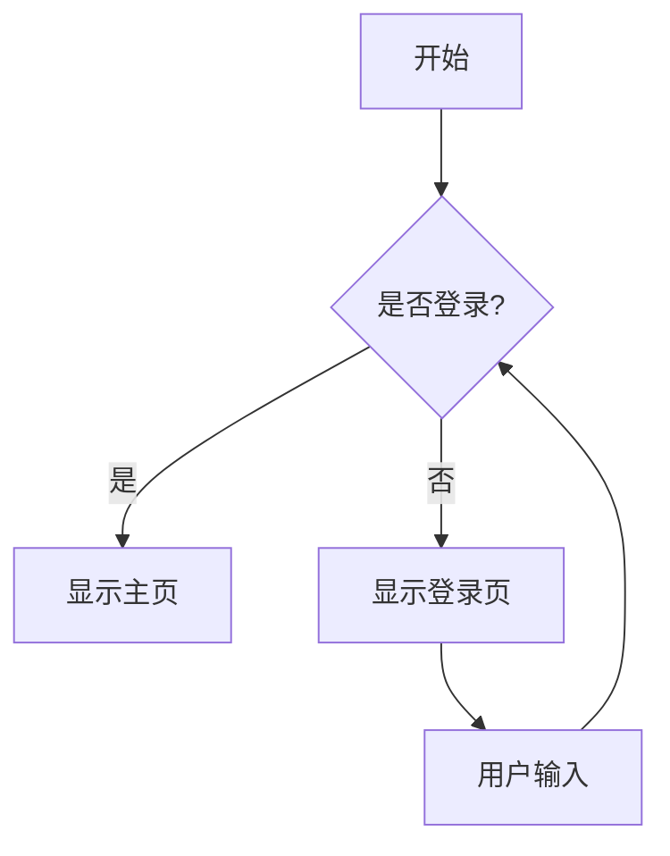
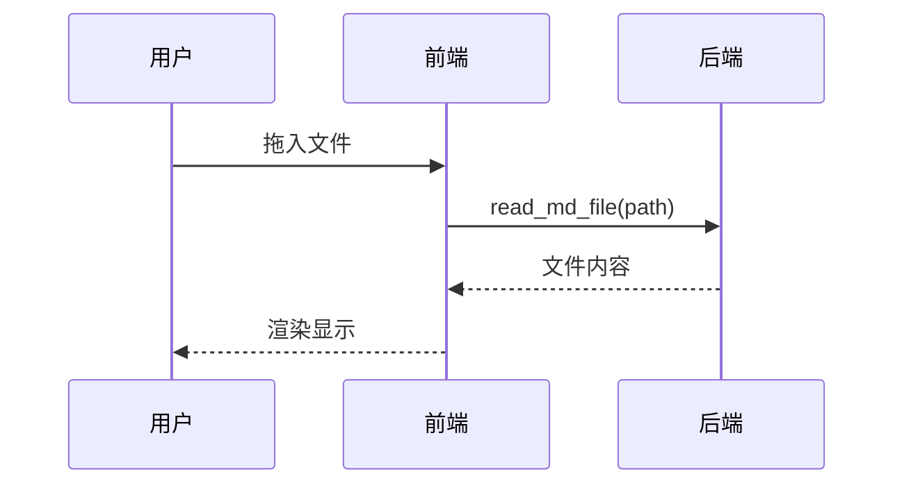
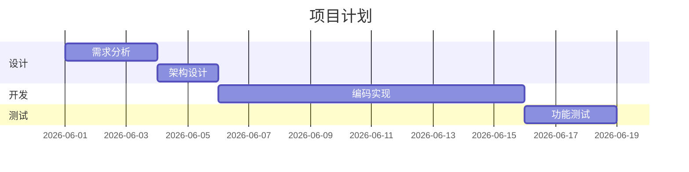

# 流程图测试

## 流程图

```mermaid
graph TD
    A[开始] --> B{是否登录?}
    B -->|是| C[显示主页]
    B -->|否| D[显示登录页]
    D --> E[用户输入]
    E --> B
```

## 时序图

```mermaid
sequenceDiagram
    participant 用户
    participant 前端
    participant 后端
    用户->>前端: 拖入文件
    前端->>后端: read_md_file(path)
    后端-->>前端: 文件内容
    前端-->>用户: 渲染显示
```

## 甘特图

```mermaid
gantt
    title 项目计划
    dateFormat YYYY-MM-DD
    section 设计
    需求分析 :a1, 2026-06-01, 3d
    架构设计 :a2, after a1, 2d
    section 开发
    编码实现 :b1, after a2, 10d
    section 测试
    功能测试 :c1, after b1, 3d
```
