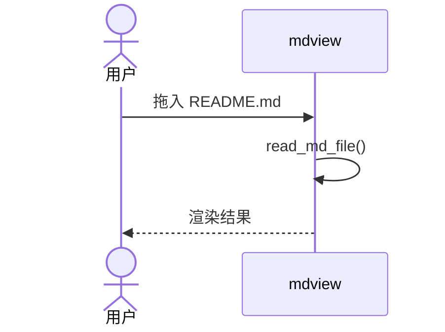

# 综合测试文档

## 元数据

- 创建时间: 2026-06-04
- 用途: mdview 端到端测试
- 标签: [测试](#), [文档](#)

## 1. 基础语法

**粗体**, *斜体*, ***粗斜体***, ~~删除线~~, `行内代码`

## 2. 链接和图片

[外部链接](https://github.com)

相对路径: [README](../README.md)

## 3. 任务列表

- [x] 完成项
- [ ] 未完成项
- [ ] 另一个未完成

## 4. 代码块

### Rust

```rust
fn main() {
    println!("Hello, world!");
    let x: Vec<i32> = vec![1, 2, 3];
    println!("{:?}", x);
}
```

### SQL

```sql
SELECT id, name, email
FROM users
WHERE active = true
ORDER BY created_at DESC
LIMIT 10;
```

## 5. 表格

| 框架 | 语言 | 体积 | 启动 |
|------|------|------|------|
| Tauri | Rust | 4MB | <1s |
| Electron | Node | 80MB | 2s |
| Wails | Go | 8MB | <1s |

## 6. 数学公式

勾股定理: $a^2 + b^2 = c^2$

欧拉公式:

$$
e^{i\pi} + 1 = 0
$$

## 7. 流程图


## 8. 时序图



## 9. 引用

> 好的工具应该像水一样,自然而无感。
> —— 某位匿名工程师

## 10. 分割线

---

完。
